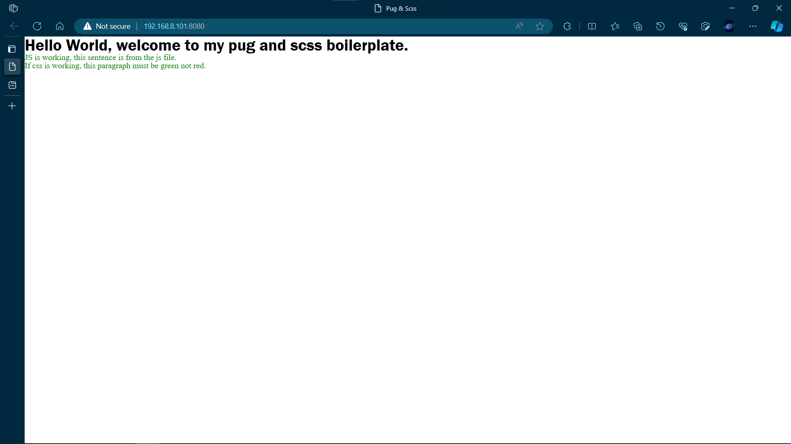

<!-- @format -->

# Boilerplate code for Pug JS and Scss

This is a simple boilerplate, starter project I made so that I can easily use pug and scss to build some projects.

## How to get Started

1. Dowload the folder.
2. Install the dependencies using `npm install`.
3. Run the app using `npm run serve`.
4. To build the app run `npm run build`.

## Screenshot

## What is Included?

- It comes with a boilerplate **index.pug** file in a views folder with some code in it to help me know if everything is set up properly.
- Comes with a starter styles folder which has an **\_index.scss** file, as our main entry and number of folders and files which ahve been inported into it. The folder and file structure was inspired by the Scss guideline which you can check out [here](https://sass-guidelin.es/).
- The two main style changes comes from the two files in the base folder, **\_reset.scss** and **\_typography.scss**. The reset file contains my prefered css reset styles and the typography files have some code that help me to determine if the scss is working properly in my project. There may be other files that contain my personal preference for some things like variables, functions, mixins and so on so got through them before you start.
- Finally, comes with a js folder with a boilerplate **index.js** file that has some small code to help me check if the js is being properly loaded.

## How to customise?

Feel free to remove the \_reset.scss file I included and add whatever you want to it. You can change it anyway you want/

## Notice

- Remove the **internal css** I put in the head tag after verifying that everything works properly. It's only there to make sure everything is working properly.
- If you add more pages you'll have to include those pages in the webpack config, there is a commennt in it on where to include it.
- To add assets to your page there is a specific way it should be done, you can read about it [here](https://github.com/webdiscus/pug-plugin). It has something to do with using `require()`.
- You can also extend the webpack config with your own loaders and config but a few loaders are not allowed and they are mentioned [here](https://github.com/webdiscus/pug-plugin). These have already been replaced by the pug-plugin that is making the project possible.

## Useful Links

All addition help needed to properly configure the project will be found in one of the below links:

- This is the article I based my boilerplate on:

  - [How to use Pug & Sass in Webpack 5 - 2022 🐶](https://dev.to/thiagoow/how-to-use-pug-sass-in-webpack-5-2022-5cpk)

- This is the documentation for the pug-plugin:

  - [Pug Plugin](https://github.com/webdiscus/pug-plugin)

- The documentation for Pug can be found [here](https://pugjs.org/api/getting-started.html).

- The Scss guideline can be found [here](https://sass-guidelin.es/).
